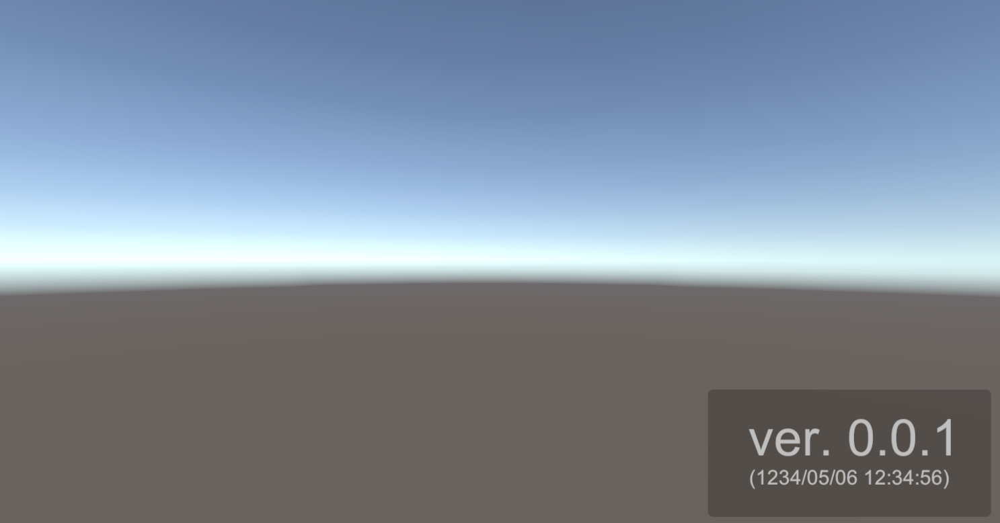

# Auto Version Writer
A simple automated version writer for Unity.



This is a simple versioning tool that automatically sets the app version based on the number of commits in git and the number of builds each time the app is built.
Please use it only for versioning during development, as it does not reflect the version of the Unity app.

## Environment
- Unity 2021.3.0f1 or higher
- Git

### Versioning Rule
- Major.Minor.Patch
  - Major - After the 100th digit of the number of commits
  - Minor - Number of commits in tens and ones
  - Patch - Build Count

## Installation
1. Open the Unity Package Manager
2. Click the + button
3. Select "Add package from git URL..."
4. Enter `https://github.com/witalosk/AutoVersionWriter.git?path=Packages/com.witalosk.auto_version_writer`

## Getting Started
1. Add `VersionViewer` prefab to your scene.
2. That's all!

## Scripting
You can get the current version of your app by `VersionGetter` class.

```c#
    public void Start()
    {
        string version = VersionGetter.Version;
        DateTime buildDate = VersionGetter.BuildDate;

        Debug.Log($"Version: {version} ({buildDate}:yyyy/MM/dd)");
    }
```